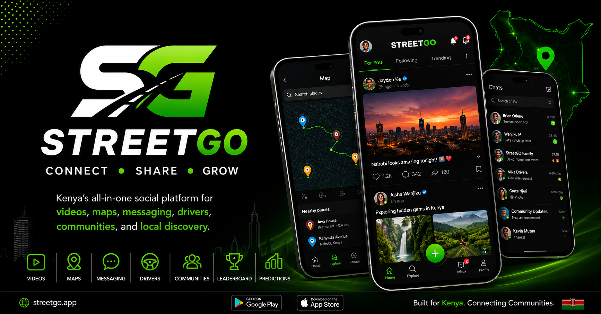

# 🚀 StreetGO

<p align="center">
  
</p>

# StreetGO is an all-in-one social platform that combines real-time messaging, community feeds, maps, driver services, predictions, and mobile experiences into a single application.


StreetGO is a modern social platform built with **Next.js, React, TypeScript, Supabase, and Capacitor**.


## 🌍 Live Demo

https://streetgo.app

---

## ✨ Features

- 💬 Real-time Messaging
- 📰 Social Feed
- ❤️ Likes & Comments
- 📸 Image Uploads
- 🎥 Video Uploads
- 📍 Maps Integration
- 🚗 Driver Services
- 📈 Prediction Engine
- 🔔 Live Notifications
- 📱 Android App

---

## 🛠 Tech Stack

- React
- Next.js
- TypeScript
- JavaScript
- Tailwind CSS
- Supabase
- PostgreSQL
- Capacitor
- Mapbox
- GitHub
- Vercel

---

## 📷 Screenshots

> Screenshots coming soon.

---

## 🚀 Getting Started

```bash
npm install

npm run dev
```

---

## 👨‍💻 Developer

**Julius Mutugi**

Self-taught Full-Stack Software Developer from Kenya.

GitHub:
https://github.com/juliusmutugi4-spec

Website:
https://streetgo.app

Email:
juliusmutugi4@gmail.com
